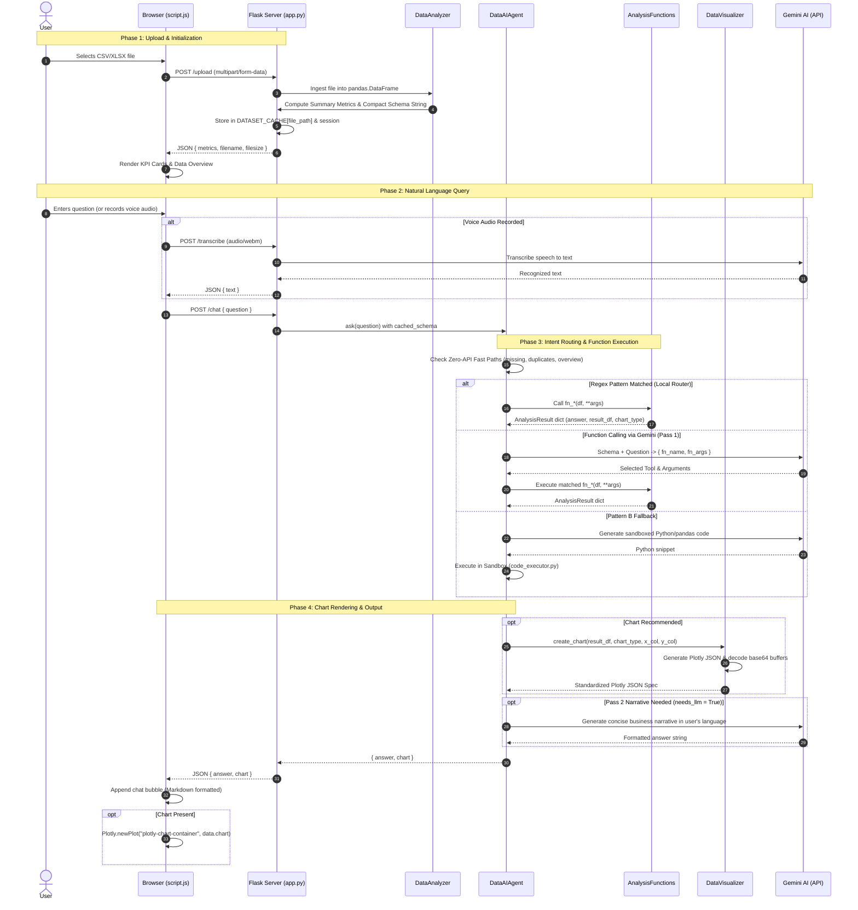

# 🏗️ Architecture & Technical Reference: AI Data Analyst Agent Web Application

This document provides a comprehensive, end-to-end technical reference for the **AI Data Analyst Agent Web Application**. It outlines the complete execution lifecycle (*"first it does this, then that, then that"*), details every component in the directory tree, explains file-by-file implementations, and provides step-by-step guides for extending and customizing the system.

---

## 📋 Table of Contents
1. [System Overview & Core Philosophy](#1-system-overview--core-philosophy)
2. [End-to-End Execution Flow (Step-by-Step)](#2-end-to-end-execution-flow-step-by-step)
3. [Workspace Directory Structure](#3-workspace-directory-structure)
4. [File-by-File Deep Dive](#4-file-by-file-deep-dive)
   - [Root Server & Entry Points](#root-server--entry-points)
   - [Services Layer (Backend Core)](#services-layer-backend-core)
   - [Frontend Layer (UI & Visuals)](#frontend-layer-ui--visuals)
   - [Configuration & Logs](#configuration--logs)
5. [Data Flow & API Contract Specifications](#5-data-flow--api-contract-specifications)
6. [Developer Extension & Customization Recipes](#6-developer-extension--customization-recipes)

---

## 1. System Overview & Core Philosophy

The AI Data Analyst Agent is a full-stack, enterprise-grade data intelligence web application. It ingests tabular datasets (CSV / Excel), profiles their data health, computes statistical metrics, and provides an interactive natural language analyst capable of instant text and voice queries.

```
                  ┌────────────────────────────────────────┐
                  │          USER INTERFACE (UI)           │
                  │   HTML5 + CSS3 + Vanilla JS (ES6+)     │
                  │  Plotly.js Visuals + Audio Recording   │
                  └───────────────────┬────────────────────┘
                                      │ HTTP / REST
                                      ▼
                  ┌────────────────────────────────────────┐
                  │         FLASK APPLICATION CORE         │
                  │  (app.py - In-Memory Caching & Routes)  │
                  └───────────────────┬────────────────────┘
                                      │
         ┌────────────────────────────┴────────────────────────────┐
         ▼                                                         ▼
┌─────────────────────────────────┐               ┌─────────────────────────────────┐
│     FAST LOCAL ENGINE (0-API)   │               │       GEMINI AI AGENT PIPELINE  │
│  - DataAnalyzer (Profiling)     │               │  - Multilingual Voice STT       │
│  - Semantic Column Classifier   │               │  - Function Calling (Pass 1)    │
│  - 25+ Local Intent Routers     │               │  - Narrative Generation (Pass 2)│
│  - 20+ Parameterized Functions  │               │  - Sandboxed Code Gen (Pass B)  │
│  - Plotly DataVisualizer        │               └─────────────────────────────────┘
└─────────────────────────────────┘
```

### Key Architectural Pillars
* **Pattern A (Deterministic Zero-API Fast Path):** Pre-written, high-performance Pandas functions that execute against the full dataset in memory. Common analytical questions run in $< 10\text{ms}$ with $\$0$ API cost.
* **Resilient Graceful Degradation:** If Gemini API quotas are exhausted (HTTP 429) or offline, the local regex router and heuristic fallback engine automatically resolve queries locally without failing.
* **Clean Plotly Deserialization:** A recursive decoding pipeline unpacks Plotly binary base64 buffers into native JavaScript arrays so charts (scatter plots, heatmaps, pareto, treemaps) render visibly and smoothly.
* **Multilingual Intelligence:** Native support for English, Hindi (हिन्दी / Hinglish), and Bengali (বাংলা) for both voice transcription and generated business narratives.

---

## 2. End-to-End Execution Flow (Step-by-Step)

When a user interacts with the application, operations follow this exact sequence:



### Detailed Lifecycle Phases:
1. **Phase 1 — Upload & Profiling:**
   - User uploads a `.csv` or `.xlsx` file.
   - `app.py` saves it into `uploads/`, loads it into a `pandas.DataFrame`, and runs `DataAnalyzer`.
   - `DataAnalyzer.get_schema_summary()` produces a compact, 10-line token-efficient schema description that is cached in `DATASET_CACHE` in memory.
   - Summary KPIs (rows, columns, missing cells, duplicates, memory footprint) are returned to update the top dashboard.

2. **Phase 2 — Query Ingestion:**
   - User types a query or records audio.
   - If audio is used, `POST /transcribe` sends the audio buffer to Gemini's multimodal audio API, returning the transcribed text.
   - `POST /chat` sends the query string along with session identifiers to Flask.

3. **Phase 3 — Intent Routing & Classification:**
   - `DataAIAgent` initializes with the cached DataFrame and schema.
   - Column roles are classified semantically (identifying sales, revenue, cost, profit, quantity, discount, date, product, category, customer columns).
   - The query passes through the **Local Intent Router** (25+ regular expression pattern families).
   - If a pattern matches, it bypasses LLM tool selection and executes the analytical function directly.
   - If no local pattern matches and API keys are active, Gemini Function Calling (Pass 1) selects the function name and arguments.
   - If no tool matches, Pattern B (sandboxed code generation) runs with fallback logging.

4. **Phase 4 — Execution & Formatting:**
   - The designated analytical function from `analysis_functions.py` runs against the full in-memory DataFrame.
   - Metrics, aggregations, percentiles, or correlations are computed with zero dataset truncation.
   - A structured `_result(...)` envelope is returned containing the template answer, summary, result DataFrame, and chart metadata.

5. **Phase 5 — Visualization & Buffer Decoding:**
   - If `chart_type` is specified, `DataVisualizer.create_chart()` builds the Plotly figure.
   - `_decode_bdata()` cleans all numpy arrays and base64 buffers into native JSON arrays.
   - The final response is delivered to the browser and rendered via `Plotly.newPlot()`.

---

## 3. Workspace Directory Structure

```
AI-Data-Analyst-Agent-web-application-main/
│
├── app.py                      # Main Flask application entry point and REST API routes
├── requirements.txt            # Python dependencies (Flask, pandas, plotly, google-generativeai, etc.)
├── Procfile                    # Deployment configuration (Heroku / cloud platform entry point)
├── .env                        # Environment variables (GEMINI_API_KEY, SECRET_KEY, GEMINI_MODEL)
├── .env.example                # Example configuration template
├── README.md                   # Project summary and quickstart guide
├── architecture_of_ai_data_analyst.md # This comprehensive technical reference document
│
├── services/                   # Backend Intelligence & Core Engines
│   ├── __init__.py             # Module initializer exposing high-level service imports
│   ├── ai_agent.py             # DataAIAgent orchestrator, semantic classifier, local router, Pass 1/2
│   ├── analysis_functions.py   # Library of 20+ parameterized business & statistical analysis functions
│   ├── visualizer.py           # DataVisualizer: 20+ Plotly chart builders and base64 array decoder
│   ├── data_analyzer.py        # Data health profiler, schema extractor, column quality reporter
│   ├── code_executor.py        # AST sandboxed Python executor, restricted environment, fallback logger
│   └── voice_transcriber.py    # Speech-to-text transcriber using Gemini audio API
│
├── templates/                  # Frontend HTML Templates
│   └── index.html              # Jinja2 Single Page Application interface
│
├── static/                     # Frontend Assets
│   ├── css/
│   │   └── style.css           # Modern SaaS design system, light theme, glassmorphism, responsive grid
│   └── js/
│       └── script.js           # Client controller, AJAX API client, Plotly lifecycle & audio recorder
│
├── logs/                       # Application Logs
│   └── fallback_queries.jsonl  # Audit log for Pattern B code generation fallback queries
│
└── uploads/                    # Temporary storage for uploaded CSV / Excel datasets
```

---

## 4. File-by-File Deep Dive

### Root Server & Entry Points

#### [`app.py`](file:///c:/Users/ANKIT/Downloads/AI-Data-Analyst-Agent-web-application-main/app.py)
* **Purpose:** The primary Flask HTTP server that manages user sessions, file uploads, in-memory caching, API endpoints, and error handling.
* **Key Global Variables:**
  * `UPLOAD_FOLDER`: Directory where uploaded files are stored temporarily.
  * `DATASET_CACHE`: In-memory dictionary (`{ file_path: { "df": DataFrame, "schema": str } }`) caching parsed DataFrames and schema strings to avoid re-reading disk or re-computing schemas on each request.
* **Key Endpoints:**
  * `GET /`: Renders `templates/index.html`.
  * `POST /upload`: Handles CSV/XLSX file uploads, generates summary metrics and cached schemas, and initializes the session.
  * `GET /dataset`: Returns dataset preview (first 15 rows), column lists, and high-level metrics.
  * `GET /profile`: Returns column-level data profiles (types, null counts, distinct values).
  * `GET /quality`: Returns automated data quality audits (missing value rates, duplicates).
  * `POST /chat`: Receives natural language questions, invokes `DataAIAgent.ask()`, and returns markdown answers and Plotly chart JSON specs.
  * `GET /suggestions`: Returns dynamically generated question prompts tailored to the dataset.
  * `GET /insights`: Returns automated rule-based and statistical business insights.
  * `POST /visualize`: Manual chart studio endpoint allowing custom X/Y selections.
  * `POST /transcribe`: Accepts audio files from browser `MediaRecorder` and returns transcribed text.
  * `GET /fallback-log`: Admin endpoint displaying logged Pattern B fallback queries.

---

### Services Layer (Backend Core)

#### [`services/ai_agent.py`](file:///c:/Users/ANKIT/Downloads/AI-Data-Analyst-Agent-web-application-main/services/ai_agent.py)
* **Purpose:** The central intelligence orchestrator. Coordinates local deterministic routing, semantic column mapping, Gemini function calling, and fallback code execution.
* **Key Components & Methods:**
  * `_build_col_roles(self)`: Automatically inspects dataset columns and categorizes them into semantic roles (`sales`, `quantity`, `discount`, `cost`, `profit`, `delivery`, `product`, `category`, `region`, `customer`, `date_col`, `target`, `rating`).
  * `_local_intent_router(self, question)`: High-speed zero-API regex routing engine containing 25+ pattern groups covering:
    1. Percentiles & Median (`get_single_percentile`, `get_median`)
    2. Threshold Filtering (`get_pct_above_threshold`, `get_filtered_summary`)
    3. Outlier Detection (`get_outliers`)
    4. Top N & Bottom N Rankings (`get_top_n`)
    5. Category Breakdown & Share of Total (`get_category_breakdown`)
    6. Correlation, Impact, & Scatter Plots (`get_correlation`)
    7. Growth Rates, YoY, MoM, QoQ (`get_growth_rate`)
    8. Seasonality & Monthly Patterns (`get_monthly_pattern`)
    9. Profit Margins & Cost Bridges (`get_profit_margin`, `get_waterfall`)
    10. Advanced Visualizations (Treemap, Heatmap, Funnel, Bubble, Pareto, Cohort Retention, KPI Gauges)
  * `ask(self, question)`: Main entry point. Checks LRU answer cache -> Runs zero-API fast paths -> Evaluates local router -> Executes Pass 1 function calling -> Executes function -> Builds chart -> Triggers Pass 2 narrative only when necessary.
  * `_pass2_generate_answer(...)`: Generates concise, 1-2 sentence business narratives in the matching user language (English, Hindi, or Bengali).
  * `_pattern_b_fallback(...)`: Fallback pipeline that prompts Gemini to generate Python/Pandas code when no pre-written tool matches, executing it safely in `code_executor.py`.

#### [`services/analysis_functions.py`](file:///c:/Users/ANKIT/Downloads/AI-Data-Analyst-Agent-web-application-main/services/analysis_functions.py)
* **Purpose:** A deterministic library of 20+ parameterized business and statistical analysis functions operating directly on Pandas DataFrames.
* **Result Envelope:** All functions return a standardized `_result` dict:
  ```python
  {
      "answer": "...",       # Formatted Markdown business answer
      "summary": "...",      # Compact data summary for Pass 2 LLM narrative
      "result_df": DataFrame,# Data subset for Plotly chart rendering
      "chart_type": "...",   # Chart type (bar, line, scatter, pie, etc.)
      "x_col": "...",        # X-axis column name
      "y_col": "...",        # Y-axis column name
      "chart_title": "...",  # Chart title string
      "chart_json": {...},   # Pre-built Plotly JSON (for complex multi-layer charts)
      "needs_llm": bool      # Flag indicating if Pass 2 narrative is required
  }
  ```
* **Key Functions Available:**
  * `fn_get_top_n`: Ranks entities by aggregated metrics (e.g., Top 10 products by revenue) and computes gap between top and bottom performers.
  * `fn_get_category_breakdown`: Computes category shares and percentage distributions with donut/bar chart outputs.
  * `fn_get_correlation`: Computes Pearson correlation matrix. For 2 variables, downsamples to 1,000 points and returns `chart_type="scatter"`. For $>2$ variables, builds a Correlation Matrix Heatmap.
  * `fn_get_growth_rate`: Calculates period-over-period growth rates (YoY, MoM, QoQ) using Pandas datetime resamplers.
  * `fn_get_monthly_pattern`: Analyzes seasonal patterns by month across multiple years.
  * `fn_get_profit_margin`: Calculates gross and operating profit margins grouped by category or segment.
  * `fn_get_pareto`: Computes cumulative percentage curves for 80/20 inventory or revenue analysis.
  * `fn_get_treemap` & `fn_get_waterfall`: Builds hierarchical value distributions and revenue bridges.
  * `fn_get_cohort_retention`: Builds cohort retention matrices for customer repeat purchase behavior.

#### [`services/visualizer.py`](file:///c:/Users/ANKIT/Downloads/AI-Data-Analyst-Agent-web-application-main/services/visualizer.py)
* **Purpose:** Generates 20+ Plotly interactive chart specifications and manages clean JSON serialization.
* **Core Mechanisms:**
  * `_decode_bdata(d)`: Recursively scans Plotly dictionaries and decodes any base64 binary buffer objects (`bdata` / `dtype`) or numpy arrays into standard native Python lists. Ensures that `Plotly.js` in the frontend can render all scatter plots and data points without failing.
  * `create_chart(df, chart_type, x_col, y_col, title, **kwargs)`: Dispatches chart generation for `bar`, `hbar`, `grouped_bar`, `stacked_bar`, `line`, `area`, `pie`, `donut`, `scatter`, `scatter_trend`, `bubble`, `histogram`, `box`, `funnel`, etc.
  * Specialized builders: `build_pareto`, `build_heatmap`, `build_treemap`, `build_waterfall`, `build_gauge`, `build_radar`, `build_cohort_heatmap`.

#### [`services/data_analyzer.py`](file:///c:/Users/ANKIT/Downloads/AI-Data-Analyst-Agent-web-application-main/services/data_analyzer.py)
* **Purpose:** Performs fast data profiling, schema summarization, and column quality audits during upload.
* **Key Methods:**
  * `get_schema_summary()`: Generates a compact, token-efficient text schema summarizing column types, non-null counts, and unique value samples.
  * `get_summary_metrics()`: Calculates total rows, total columns, memory usage, duplicate row count, and missing value percentages.
  * `get_column_profiles()`: Computes per-column statistics (min, max, mean, distinct count, null count, top values).
  * `get_quality_report()`: Audits data cleanliness, flagging high missing rates or cardinality anomalies.

#### [`services/code_executor.py`](file:///c:/Users/ANKIT/Downloads/AI-Data-Analyst-Agent-web-application-main/services/code_executor.py)
* **Purpose:** Sandboxed Python code execution engine for Pattern B fallbacks.
* **Safety Rules:**
  * AST validation blocks unauthorized imports, file system access, network calls, and OS execution.
  * Read-only DataFrame access prevents in-place mutation of the primary dataset.
  * 8-second execution timeout prevents infinite loops.
  * `log_fallback_query()` records queries, generated code, and execution outcomes to `logs/fallback_queries.jsonl`.

#### [`services/voice_transcriber.py`](file:///c:/Users/ANKIT/Downloads/AI-Data-Analyst-Agent-web-application-main/services/voice_transcriber.py)
* **Purpose:** Transcribes browser-recorded audio using Gemini multimodal capabilities.
* **Key Methods:**
  * `transcribe_audio(audio_bytes, mime_type)`: Sends audio payloads directly to Gemini, returning clean transcription strings across English, Hindi, and Bengali.

---

### Frontend Layer (UI & Visuals)

#### [`templates/index.html`](file:///c:/Users/ANKIT/Downloads/AI-Data-Analyst-Agent-web-application-main/templates/index.html)
* **Purpose:** The single-page web interface.
* **Main Sections:**
  * **Header & Top Navbar:** Dataset upload dropzone, status indicators, and quick statistics.
  * **KPI Summary Grid:** Cards displaying row count, column count, duplicate rows, and missing data percentage.
  * **Main Workspace Tabs:**
    1. *Chat Analyst Tab:* Natural language conversation window with markdown rendering, suggested question chips, and voice input button.
    2. *Data Table Tab:* Interactive dataset preview table.
    3. *Data Quality Tab:* Column health and missing data breakdown.
    4. *Visual Studio Tab:* Dedicated chart workbench with manual dropdown controls.
  * **Plotly Chart Container:** `<div id="plotly-chart-container">` for interactive chart rendering.

#### [`static/js/script.js`](file:///c:/Users/ANKIT/Downloads/AI-Data-Analyst-Agent-web-application-main/static/js/script.js)
* **Purpose:** Client-side JavaScript application managing DOM events, AJAX requests, audio recording, and Plotly graphics.
* **Key Responsibilities:**
  * Manages file uploads via `fetch("/upload")` with progress feedback.
  * Implements browser `MediaRecorder` audio capture for voice queries.
  * Handles `/chat` requests, streaming UI messages, and rendering Markdown tables and bold text.
  * Calls `Plotly.newPlot("plotly-chart-container", data.chart.data, data.chart.layout)` to render responsive visualizations.
  * Listens to tab switches and window resize events to trigger `Plotly.Plots.resize()`.

#### [`static/css/style.css`](file:///c:/Users/ANKIT/Downloads/AI-Data-Analyst-Agent-web-application-main/static/css/style.css)
* **Purpose:** Visual styling and responsive design system.
* **Key Features:**
  * Curated light SaaS color palette (`#2563EB` primary, `#F8FAFC` background, `#334155` typography).
  * Glassmorphism cards with smooth hover transitions.
  * Responsive flex and CSS grid layouts supporting desktop, tablet, and mobile displays.

---

### Configuration & Logs

* **[`.env`](file:///c:/Users/ANKIT/Downloads/AI-Data-Analyst-Agent-web-application-main/.env):** Contains runtime secrets:
  * `GEMINI_API_KEY`: API key for Google Gemini.
  * `GEMINI_MODEL`: Configured model name (`gemini-flash-latest` / `gemini-1.5-flash`).
  * `SECRET_KEY`: Flask session encryption key.
* **[`logs/fallback_queries.jsonl`](file:///c:/Users/ANKIT/Downloads/AI-Data-Analyst-Agent-web-application-main/logs/fallback_queries.jsonl):** JSON Lines log storing all queries that utilized Pattern B code generation, enabling developers to identify missing pre-written functions.

---

## 5. Data Flow & API Contract Specifications

### 1. `POST /chat`
* **Request:**
  ```json
  {
    "question": "Does a higher product price affect the quantity sold?"
  }
  ```
* **Response:**
  ```json
  {
    "answer": "**Correlation between Product Price and Order Item Quantity:** **r = 0.049** (very weak / negligible relationship).\n- Higher values of **Product Price** do **not** appear to significantly increase or drive **Order Item Quantity**.",
    "chart": {
      "data": [
        {
          "type": "scatter",
          "mode": "markers",
          "x": [46.81, 45.53, 43.46, 65.15],
          "y": [4, 2, 5, 1],
          "marker": { "color": "#2563EB", "opacity": 0.75 }
        }
      ],
      "layout": {
        "title": { "text": "Scatter Plot: Product Price vs Order Item Quantity (r = 0.049)" },
        "template": "plotly_white"
      }
    }
  }
  ```

---

## 6. Developer Extension & Customization Recipes

### Recipe 1: How to Add a New Analysis Function

1. Open [`services/analysis_functions.py`](file:///c:/Users/ANKIT/Downloads/AI-Data-Analyst-Agent-web-application-main/services/analysis_functions.py).
2. Define your function accepting `df: pd.DataFrame` and explicit column parameters:
   ```python
   def fn_get_discount_efficiency(df: pd.DataFrame, discount_col: str, sales_col: str) -> Dict[str, Any]:
       """Calculates revenue generated per dollar of discount given."""
       total_discount = df[discount_col].sum()
       total_sales = df[sales_col].sum()
       ratio = round(total_sales / total_discount, 2) if total_discount > 0 else 0
       answer = f"**Discount Efficiency Ratio**: **${ratio}** revenue generated per $1 discount."
       return _result(answer, summary=answer, needs_llm=False)
   ```
3. Register the function in `ANALYSIS_FUNCTIONS` in [`services/ai_agent.py`](file:///c:/Users/ANKIT/Downloads/AI-Data-Analyst-Agent-web-application-main/services/ai_agent.py):
   ```python
   "get_discount_efficiency": lambda df, **kw: af.fn_get_discount_efficiency(df, **kw),
   ```

---

### Recipe 2: How to Add a New Intent Routing Pattern

1. Open [`services/ai_agent.py`](file:///c:/Users/ANKIT/Downloads/AI-Data-Analyst-Agent-web-application-main/services/ai_agent.py) and locate `_local_intent_router`.
2. Add a new regex pattern block:
   ```python
   # ── NEW PATTERN: DISCOUNT EFFICIENCY ────────────────────────────────
   if re.search(r"\b(discount efficiency|revenue per discount|roi on discount)\b", q):
       disc_col = roles.get("discount")
       sales_col = roles.get("sales")
       if disc_col and sales_col:
           return ("get_discount_efficiency", {"discount_col": disc_col, "sales_col": sales_col})
   ```

---

### Recipe 3: How to Add a New Chart Type

1. Open [`services/visualizer.py`](file:///c:/Users/ANKIT/Downloads/AI-Data-Analyst-Agent-web-application-main/services/visualizer.py) and locate `DataVisualizer.create_chart()`.
2. Add a new branch matching your chart identifier:
   ```python
   elif ct in ("violin", "violinplot"):
       fig = px.violin(df, x=x_col, y=y_col, title=title, box=True, points="all", color_discrete_sequence=_COLORS)
   ```
3. `_to_json(fig)` will automatically decode all numpy buffers and format the JSON for the frontend.

---

### Recipe 4: How to Inspect Fallback Logs

To see queries that required AI code generation and identify opportunities for new pre-written functions:
1. Open your browser or run a GET request to:
   ```
   http://localhost:5000/fallback-log?n=20
   ```
2. Inspect the returned JSON or check [`logs/fallback_queries.jsonl`](file:///c:/Users/ANKIT/Downloads/AI-Data-Analyst-Agent-web-application-main/logs/fallback_queries.jsonl).
